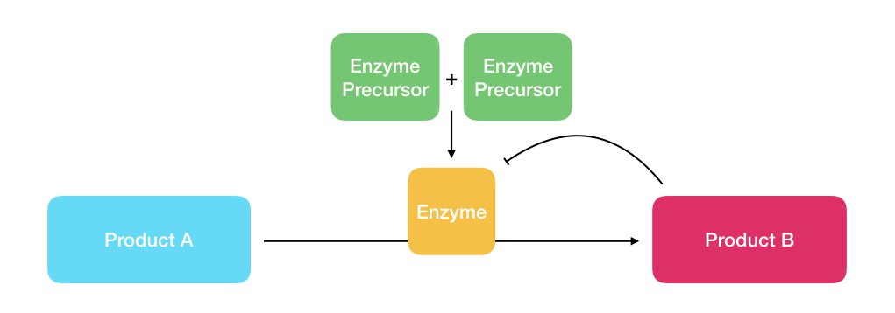
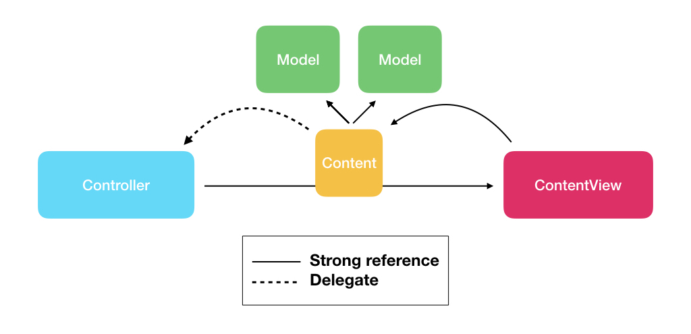

# Controller-Content-ContentView

*Discover a fresh new design pattern, easy and poredictable, and how you can set up your own. Some human before you created the one you are using, why not be that human?*

You can read the full article on Medium:

In a developer life comes the time to start thinking about code architecture and not only to code itself. One day you wake up and realize that your old dear friend MVC is not the best solution for long term projects or anything that is more complex than a tutorial on the last cool iOS feature. When I joined [Lepaya](https://www.lepaya.com/en/) I had the opportunity to build our iOS app from scratch, so I decided to do go deep in the design pattern seriously, to find the best fit.

I started to look around for my new way of organizing code, at least the first new way. I was looking for something as easy as powerful, highly predictable, which implementation feel natural. I stumble upon MVVM, MVP, Viper, and many others. My issue with all of the existing design patterns is that they are perfectly crafted for an engineer mind, but if you come from a ten years background in Molecular Biology, they all seem unnatural and complicated. **Every developer and every development team should choose the design pattern that feels more comfortable.** If you don't find anything suitable for your needs, why not creating your own? I end up deciding to start from what I know best: biochemical pathways.

Inside a cell, every enzymatic reaction is part of a chain, and very often these chains are self-regulated by their products: when the required amount of product is reached, it blocks its production itself as shown in **image 1**.

|  |
|:--:|
| **Image 1:** example of self-regulated biochemical pathway.|

**Product A** is converted to **Product B** by an **Enzyme** that is synthesized from its two **precursors**. When product B is enough concentrated it stops the activity of the enzyme so no more Product B is made. Leaving out the biological meaning of this diagram, it already seems a kind of architecture, the final design pattern is shown in **image 2**.

|  |
|:--:|
| **Image 2:** Visual representation of the ControllerContentContentView design pattern (CCC)|

Does it seem more familiar? The Controller owns an instance of Content and ContentView. The ContentView itself is instantiated with Controller’s Content instance. So the Controller can manage the Content and the ContentView, the ContentView can manage the Content, but to communicate back to the Controller the only path is the Content Delegate. As many things, It's easier to explain by an example, let's take a look at its implementation using Swift.
